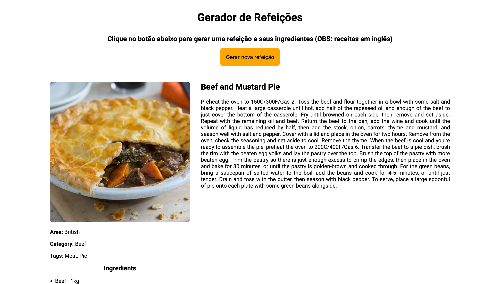

# Gerador de receitas

## Tabela de conteúdos

- [Geral](#geral)
  - [Screenshot](#screenshot)
  - [Desenvolvido com](#desenvolvido-com)
  - [O que aprendi](#o-que-aprendi)
  - [Recursos úteis](#recursos-uteis)
- [Autor](#autor)

## Geral

Esse projeto é um site que gera receitas, onde o usuário pode:
- Visualizar a receita
- Visualizar os ingredientes necessários
- Nacionalidade e categoria das receitas
- Visualizar um vídeo que ensina a fazer a receita
- Visualizar a fonte da receita

Esse site foi feito utilizando a API do site TheMealDB.

### Screenshot

### Desenvolvido com

- HTML5
- CSS3
- JavaScript
- API do TheMealDB

### O que aprendi

Nesse projeto aprendi a manipular o HTML interno dos elementos a partir de JavaScript e a utilizar a tag iframe do HTML.

### Recursos úteis

- [API do TheMealDB](https://www.themealdb.com/api.php)

## Autor

- GitHub - [marcelosarinho](https://github.com/marcelosarinho)
- LinkedIn - [Marcelo Sarinho](www.linkedin.com/in/marcelo-sarinho)